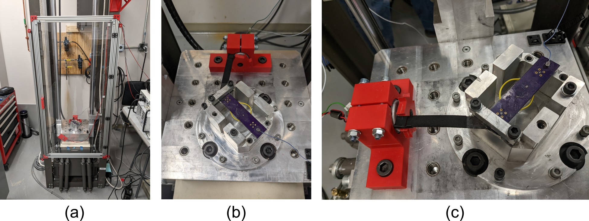

# Dataset-7-forced-vibration-and-shock
A dataset that looks at PCBs under continuous vibration before undergoing shock test

This dataset contains the measured acceleration data for an electronics unit under continuous vibration before undergoing a shock test. Figure 1 presents the experimental test configuration where the package is mounted on a Lansmont Model P30 shock test system designed to generate a continuous forced vibration before, after, and during a shock event <a href="https://www.youtube.com/watch?v=kBaZF9kUQLQ&ab_channel=ARTS-LabattheUniversityofSouthCarolina">here</a>.

  

Figure 1: Image of the test, showing: (a) the shock test system, (b) the front view of the test setup on the drop table, and (c) the side view of the test setup on the drop table. (click the image to view a video of the test on YouTube). 

## Licensing and Citation

This work is licensed under a Creative Commons Attribution-ShareAlike 4.0 International License [cc-by-sa 4.0].

Cite this data as: 

Devon Goshorn, Joud Satme, and Austin Downey. Dataset-7-forced-vibration-and-shock, October 2019. URL: https://github.com/High-Rate-SHM-Working-Group/Dataset-7-forced-vibration-and-shock

#### Bibtex

@Misc{Goshorn2019Dataset7Forced,  
  author = {Devon Goshorn and Joud Satme and Austin Downey},  
  month  = oct,  
  title  = {Dataset-7-forced-vibration-and-shock},  
  year   = {2019},  
  groups = {High-Rate-SHM-Working-Group},  
  url    = {https://github.com/High-Rate-SHM-Working-Group/Dataset-7-forced-vibration-and-shock},  
}  
